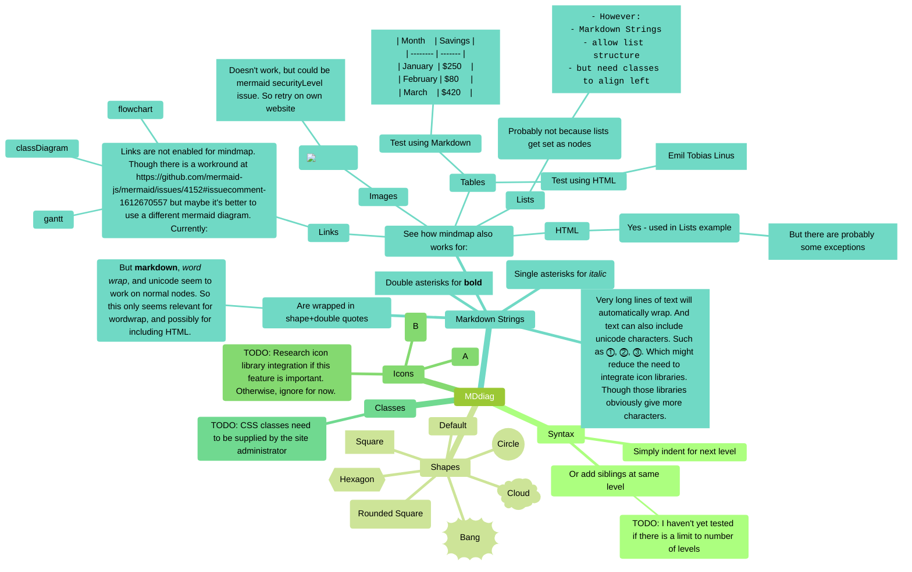

# MDdiag

MDdiag (formerly MDmap) is my working title for a free markdown-based mind map project. To start, I'll use [mermaid](https://mermaid.js.org/syntax/mindmap.html). Because it's available immediately in GitHub. I'm aware of [markmap](https://markmap.js.org/). But I haven't investigated it, or any other alternatives. Because that is beyond my current scope for this project.

Note that this is a learning project for me. Which means that I'm using it to gain practical experience of developing free mindmaps using mermaid markdown in this free GitHub repository. So it is not a complete guide. Though I hope I can develop it into one. Complete with examples and usable templates.

## MDdiag Purpose & Scope

My immediate purpose is to find an alternative for MindMup. Because I no longer want to pay for its premium features. Noting that it is great value for commercial projects. But, in retirement, I'm looking for free options for all my Internet services.

To that end, my scope starts with looking at all my use cases for MindMup. Then assessing if these can be converted to MDdiag. But prior to that, I will summarize [mermaid](https://mermaid.js.org/syntax/mindmap.html) for:

- Syntax
- Shapes
- Icons
- Classes
- Markdown Strings

If I can use MDdiag for all my use cases, I will then consider if I can integrate it into Shrewdies.com. Or a separate MDdiag.shrewdies.com project.

[240627 edit] On reflection, I prefer the MDdiag.Shrewdies.com approach with a #BuildInPublic mindset. Using the Hive Blockchain to store MDdiags. Presented by my own mermaid-enabled frontend. However, this raises privacy issues as blockchain data is public. And encrypting it seems like overkill. So, I've added this as a potential issue.

## MDdiag Example

## MDdiag Pages

- 
- [MDdiag Icon](https://github.com/kct2020/mddiag/blob/main/mddiag-icon.md#mddiag-icon)
- [MDmap Starter](https://github.com/kct2020/mddiag/blob/main/mdmap-starter.md#mdmap-starter)
- [MDdiag Potential Issues](https://github.com/kct2020/mddiag/blob/main/mddiag-potential-issues.md#mddiag-potential-issues)
- [MDmap Action Plan 240420](https://github.com/kct2020/mddiag/blob/main/mdmap-action-plan-240420.md#mdmap-action-plan-240420)
- [MDdiag Action Plan 240627](https://github.com/kct2020/mddiag/blob/main/mddiag-action-plan-240627.md#mddiag-action-plan-240627)
- [MDdiag Action Plan 240628](https://github.com/kct2020/mddiag/blob/main/mddiag-action-plan-240627.md#mddiag-action-plan-240628)
- [MDdiag Overview](https://github.com/kct2020/mddiag/blob/main/mindmup-overview.md#mindmup-overview)
- [MindMup Use Cases](https://github.com/kct2020/mddiag/blob/main/mindmup-use-cases.md#mindmup-use-cases)
