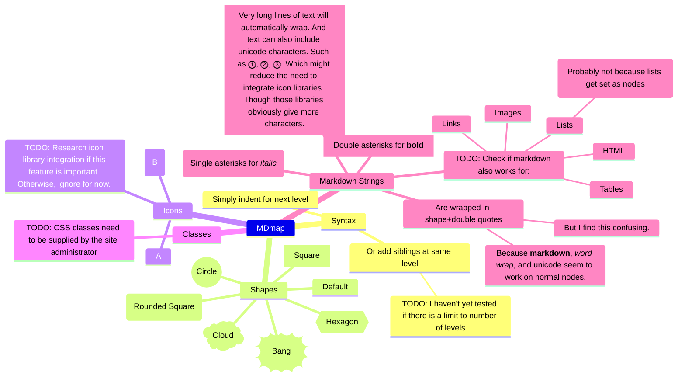
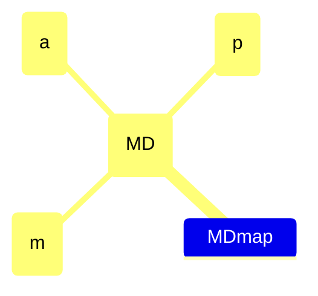
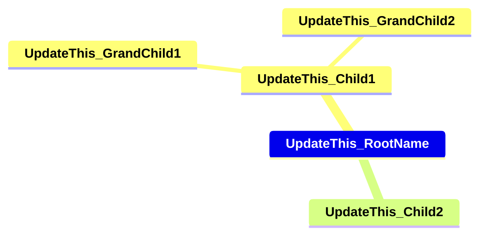
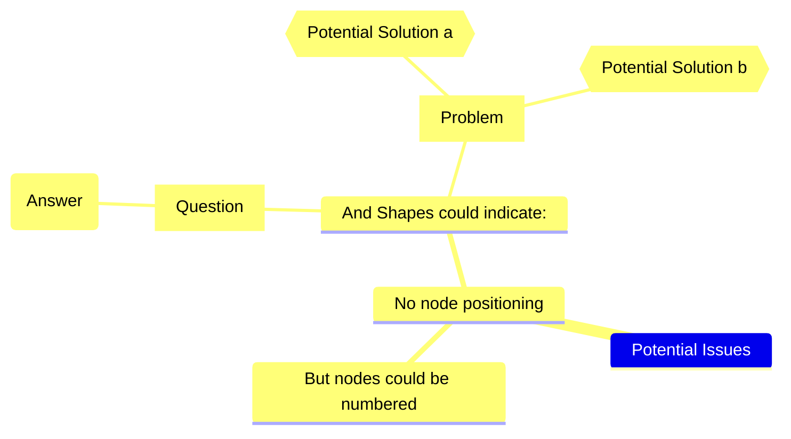
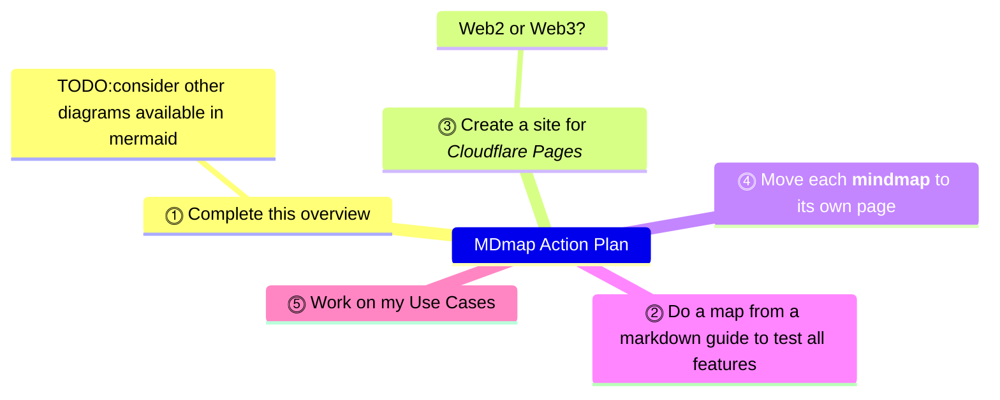
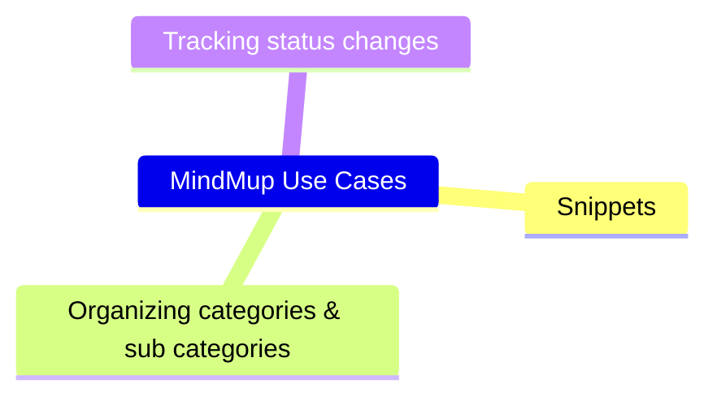

# MDmap

MDmap is my working title for a free markdown-based mind map project. To start, I'll use [mermaid](https://mermaid.js.org/syntax/mindmap.html). Because it's available immediately in GitHub. I'm aware of [markmap](https://markmap.js.org/). But I haven't investigated it, or any other alternatives. Because that is beyond my current scope for this project.

Note that this is a learning project for me. Which means that I'm using it to gain practical experience of developing free mindmaps using mermaid markdown in this free GitHub repository. So it is not a complete guide. Though I hope I can develop it into one. Complete with examples and usable templates.

## MDmap Purpose & Scope

My immediate purpose is to find an alternative for MindMup. Because I no longer want to pay for its premium features. Noting that it is great value for commercial projects. But, in retirement, I'm looking for free options for all my Internet services.

To that end, my scope starts with looking at all my use cases for MindMup. Then assessing if these can be converted to MDmap. But prior to that, I will summarize [mermaid](https://mermaid.js.org/syntax/mindmap.html) for:

- Syntax
- Shapes
- Icons
- Classes
- Markdown Strings

If I can use MDmap for all my use cases, I will then consider if I can integrate it into Shrewdies.com. Or a separate mdmap.shrewdies.com project.

## MDmap Example

## MDmap Icon 

## MDmap Starter

## MDmap Potential Issues

## MDmap Action Plan

## MindMup Use Cases

