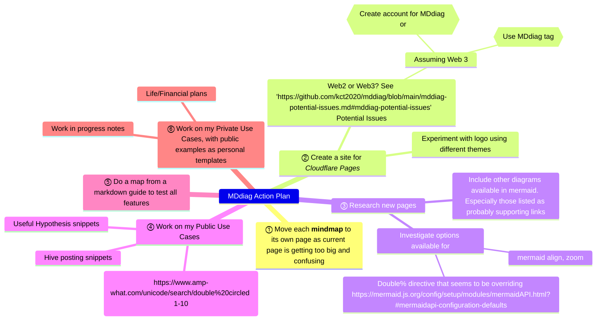

# MDdiag Action Plan 240627

```mermaid
mindmap
MDdiag Action Plan
  ⓵ Move each **mindmap** to its own page as current page is getting too big and confusing
  ⓶ Create a site for *Cloudflare Pages*
    Web2 or Web3? See 'https://github.com/kct2020/mddiag/blob/main/mddiag-potential-issues.md#mddiag-potential-issues' Potential Issues
      Assuming Web 3
        {{Create account for MDdiag or}}
        {{Use MDdiag tag}}
    Experiment with logo using different themes
  ⓷ Research new pages
    Include other diagrams available in mermaid. Especially those listed as probably supporting links
    Investigate options available for
      mermaid align, zoom
      Double% directive that seems to be overriding https://mermaid.js.org/config/setup/modules/mermaidAPI.html?#mermaidapi-configuration-defaults
  ⓸ Work on my Public Use Cases
    Common unicode characters (https://www.amp-what.com/unicode/search/double%20circled 1-10)
    Useful Hypothesis snippets
    Hive posting snippets
  ⓹ Do a map from a markdown guide to test all features
  ⓺ Work on my Private Use Cases, with public examples as personal templates
    Work in progress notes
    Life/Financial plans
```

***

Return from MDdiag Action Plan 240627 to [MDdiag Home Page](https://github.com/kct2020/mddiag?tab=readme-ov-file#mddiag)