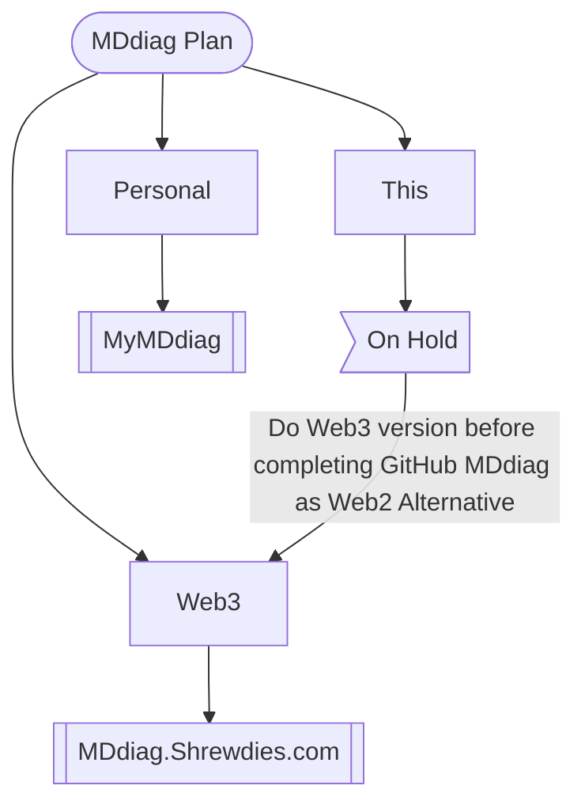

# MDdiag Action Plan 240628

## MDdiag Action Plan Mermaid Flowchart

#### Clicks

- MyMDdiag (private)
- MDdiag.Shrewdies

I will update links as projects become usable.

## MDdiag Action Plan

I'm working on my own private diagrams in a GitHub repository similar to this. And as my mermaid skills improve, I will improve this repo. But my main priority is to develop a Web3 version of this repo. Which I will base on my forthcoming personal Web3 blog.

***

Return from MDdiag Action Plan 240628 to [MDdiag Home Page](https://github.com/kct2020/mddiag?tab=readme-ov-file#mddiag)
