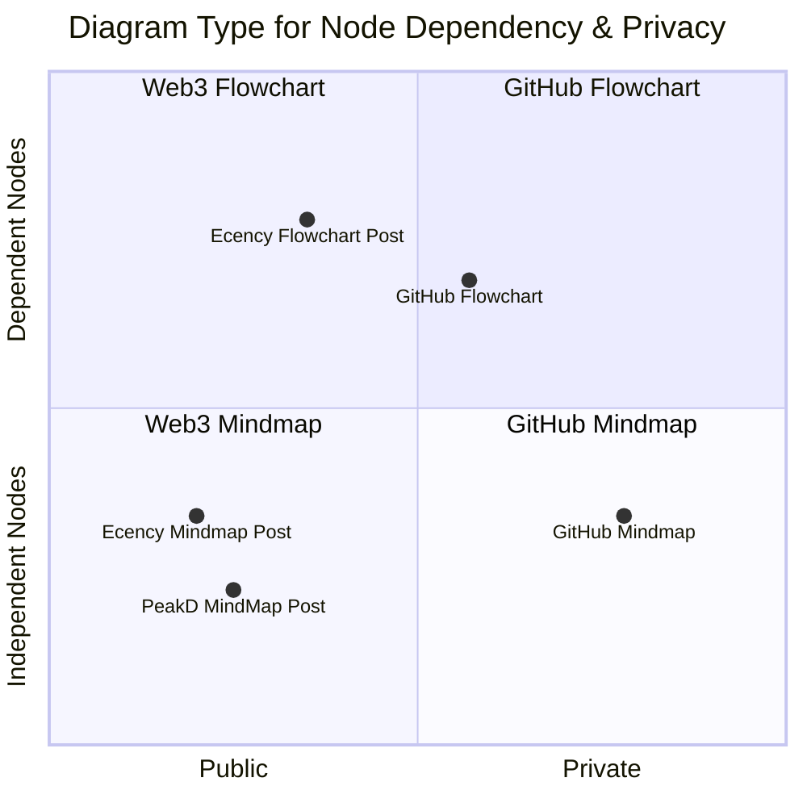

# MDdiag Node Overview

## Nodes

Nodes are tasks, topics, ideas, or other items that make up your project. Typically, when brainstorming, we use mindmaps to group items in relevant categories. But we don't think about dependencies until later. However, if items should follow a sequence, flowcharts are often more appropriate. Especially where starting tasks depends on the completion of earlier tasks.

As you can see above, mermaid supports other diagram types. And I will suggest appropriate diagram types for use cases as I develop the documentation for MDdiag.

## Privacy

Web3, as I implement it, cannot be private. So if your data is confidential, you must set your GitHub repository to `Private`. Or use other mermaid solutions. Such as [Mermaid Chart](https://www.mermaidchart.com/). However, those are beyond the scope of this project.

If you prefer to avoid Web3, you can create your public diagrams on GitHub. Just like this repo! And I intend to add better documentation with step-by-step examples. But as per [my latest MDdiag action plan](https://github.com/kct2020/mddiag/blob/main/mddiag-action-plan-240627.md#mddiag-action-plan-240628), I am currently prioritizing my Web3 version.

***

Return from MDdiag Action Plan 240628 to [MDdiag Home Page](https://github.com/kct2020/mddiag?tab=readme-ov-file#mddiag)
