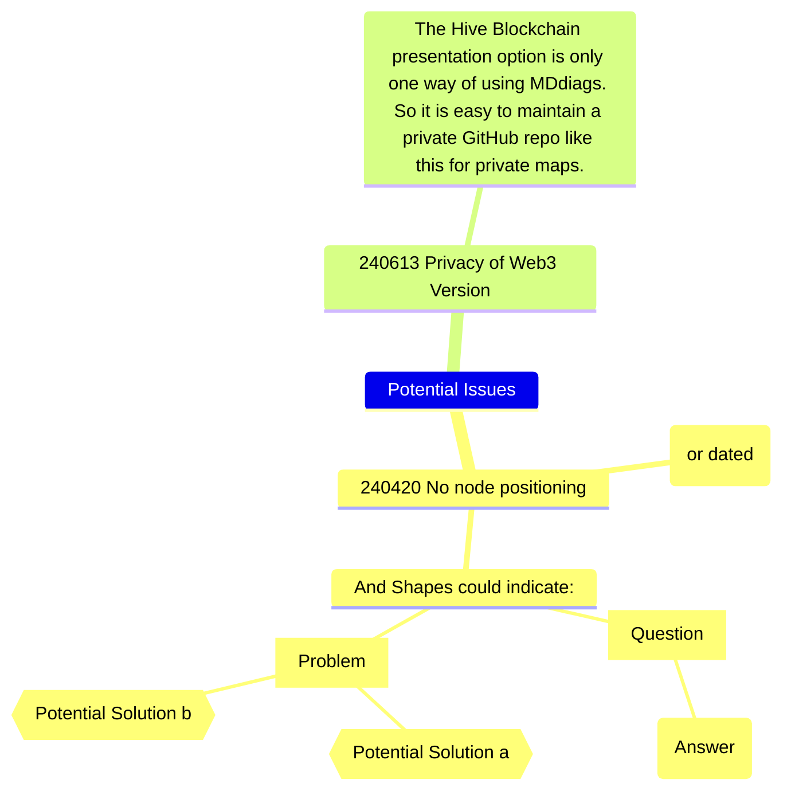

# MDdiag Potential Issues

```mermaid
mindmap
Potential Issues
  240420 No node positioning
    But nodes could be numbered (or dated)
    And Shapes could indicate:
        [Question]
            (Answer)
        [Problem]
            {{Potential Solution a}}
            {{Potential Solution b}}
  240613 Privacy of Web3 Version
    The Hive Blockchain presentation option is only one way of using MDdiags. So it is easy to maintain a private GitHub repo like this for private maps.
```

Return from MDdiag Potential Issues to [MDdiag Home Page](https://github.com/kct2020/mddiag?tab=readme-ov-file#mddiag)