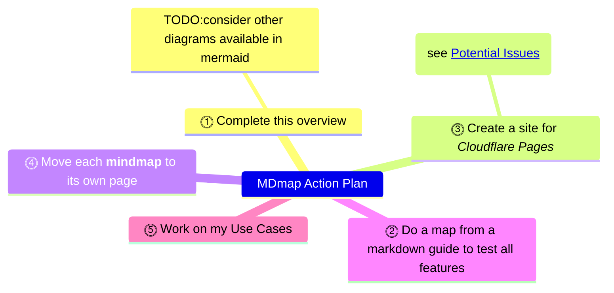

# MDmap Action Plan 240420

```mermaid
mindmap
MDmap Action Plan
  ⓵ Complete this overview
    TODO:consider other diagrams available in mermaid
  ⓷ Create a site for *Cloudflare Pages*
    Web2 or Web3? (see <a href='https://github.com/kct2020/mdmap?tab=readme-ov-file#mdmap-potential-issues'>Potential Issues</a>)
  ⓸ Move each **mindmap** to its own page
  ⓶ Do a map from a markdown guide to test all features
  ⓹ Work on my Use Cases
```

Return from MDmap Action Plan 240420 to [MDdiag Home Page](https://github.com/kct2020/mddiag?tab=readme-ov-file#mddiag)