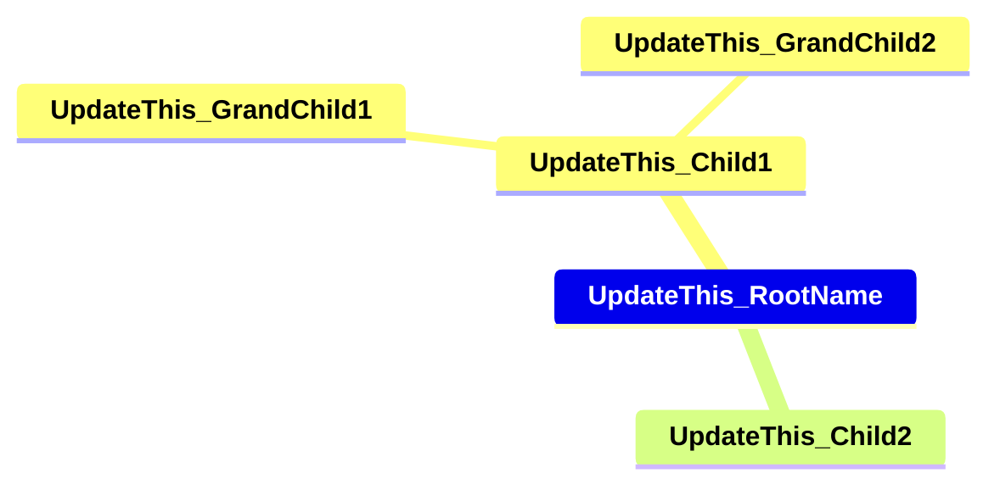

# MDmap Starter

```mermaid
mindmap
__UpdateThis_RootName__
  __UpdateThis_Child1__
   __UpdateThis_GrandChild1__
   __UpdateThis_GrandChild2__
  __UpdateThis_Child2__
```

Return from MDmap Starter to [MDdiag Home Page](https://github.com/kct2020/mddiag?tab=readme-ov-file#mddiag)