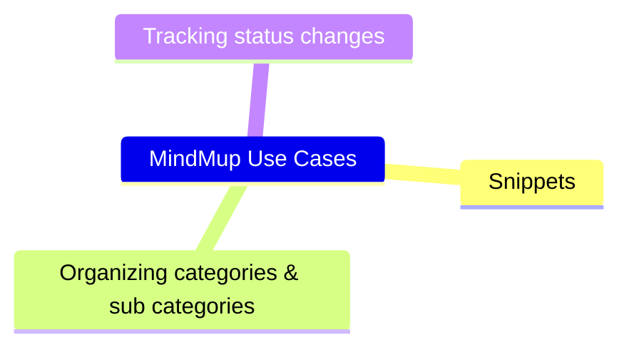

# MindMup Use Cases

MindMup Use Cases is a diagram to guide my transmigration from MindMup to MDdiag. So, I will use it to list all the MindMup files that I currently use. Then track my progress by link to the MDdiag replacement.

Leave MindMup Use Cases to return to [MDdiag Home Page](https://github.com/kct2020/mddiag?tab=readme-ov-file#mddiag)