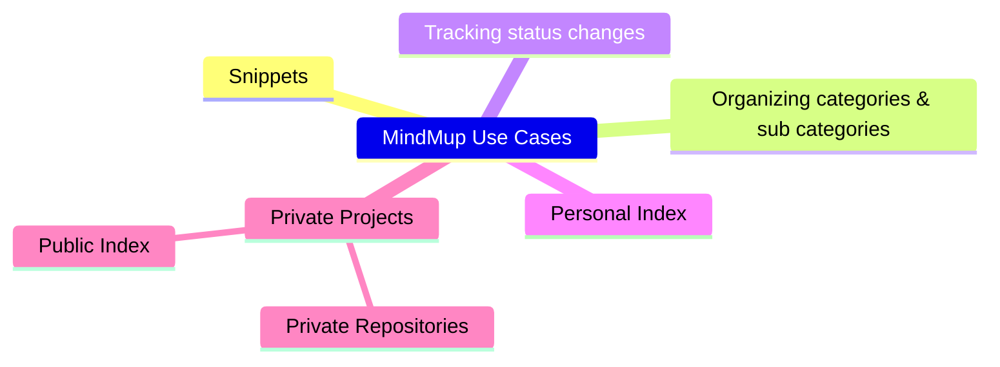

# MindMup Use Cases

MindMup Use Cases is a diagram to guide my transmigration from MindMup to MDdiag. So, I will use it to list all the MindMup files that I currently use. Then track my progress by link to the MDdiag replacement.

## 240627 Private Projects

Ultimately, I want my own MDdiag "Files List" to replace the *MindMup Gold Files* index page. Which must include snippets, templates, and progress charts that I use regularly. Both public and private. Ideally, this would be a public page that other people could use as an example. Which is OK for private projects, as the links would be to private repositories. So they could only be accessed by people who I give permissions.

But MDdiag.Shrewdies.com will list all public diagrams created on Ecency (unless I configure it to display all posts with an MDdiag tag). Therefore, I need to investigate if I can easily adapt my personal Web3 blog to be a communal topic blog.

## 240627 Personal Index

My working hypothesis is that the best way to go is to create a MDdiag website using the tag. Then allow other indexing by use case. So, also categorize by: Index, Snippet, Progress, Organize, Status, etc. Then users can easily bookmark their own MDdiag Personal Index. As well as any other regularly used diagrams.

In the meantime, I will create a MyMDdiag repo to hold personal projects prior to launching the site.

Leave MindMup Use Cases to return to [MDdiag Home Page](https://github.com/kct2020/mddiag?tab=readme-ov-file#mddiag)